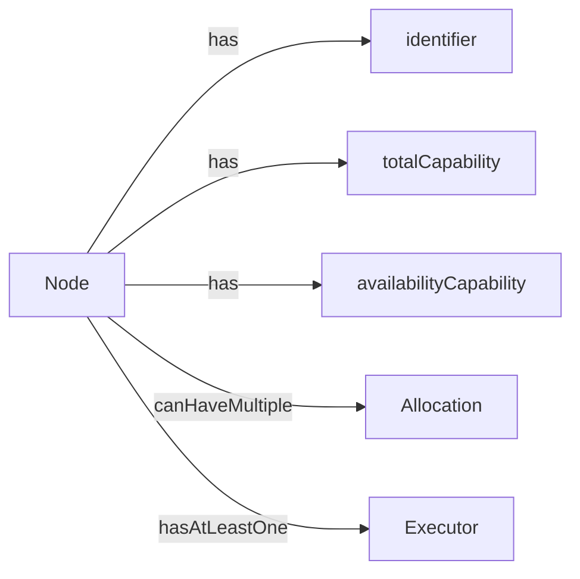

# Introduction

Node is an Actor that is a running instance of a DMS. When the DMS is onboarded, a Node will be created that has networking, a view of the network and other Nodes around it and the ability to manage Allocations which are also actors by async messaging.

## Types and data models

### Allocation

As per initial [specification of NuNet ontology / nomenclature](https://nunet.gitlab.io/research/blog/posts/ontology-and-nomenclature/#node), `node` extends the `models.Actor` interface and therefore has a proper address, can receive and send messages and has internal state. 

* type definition: [nunet/open-api/platform-data-model/device-management-service/jobs/allocation.go]((https://gitlab.com/nunet/open-api/platform-data-model/-/blob/proposed/device-management-service/dms/node.go);
