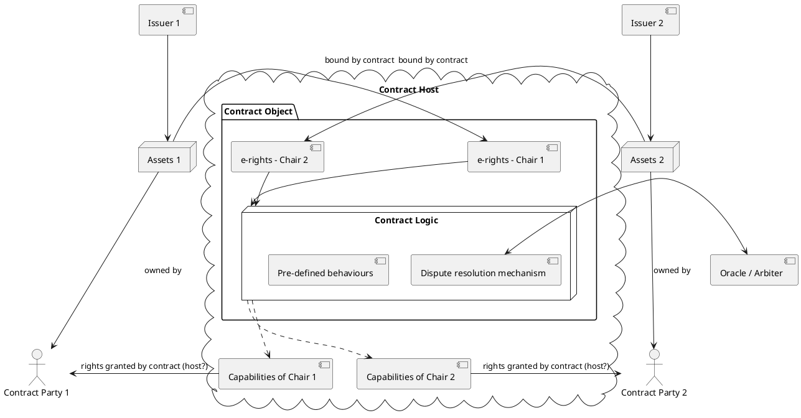

# NuNet Contracts and Tokenomics Architecture Specification

## Table of Contents
1. [Executive Summary](#executive-summary)
2. [Architecture Overview](#architecture-overview)
3. [Core Design Principles](#core-design-principles)
4. [Conceptual Framework](#conceptual-framework)
5. [Implementation Architecture](#implementation-architecture)
6. [References and Links](#references-and-links)

---

## Executive Summary

The NuNet contracts and tokenomics system represents a sophisticated integration of **Agoric's Electronic Rights Transfer Protocol (ERTP)** with NuNet's **object capability model** (nuActor system). This architecture enables secure, decentralized economic contracts for compute resource sharing while maintaining compatibility with both off-platform (Solutions-based) and on-platform (P2P) contract execution.

**Key Innovation**: The system unifies object capabilities (UCAN/nuActor) with economic contracts (Agoric ERTP), creating a secure, capability-based tokenomics layer that can operate with both trusted third parties and blockchain-based execution environments.

---

## Architecture Overview

### System Components Hierarchy

```
NuNet Platform
├── Device Management Service (DMS)
│   ├── Contract Sub-package
│   │   ├── Contract Objects (nuActors)
│   │   ├── Contract Logic (FSM)
│   │   └── Capability Management
│   ├── Orchestration Layer
│   └── nuActor System Integration
├── Contract Database (CloverDB/External)
└── Contract Host (Trusted Execution Environment)
```

### Core Architecture Diagram

Based on the detailed design from [GitLab Issue #371](https://gitlab.com/nunet/architecture/-/issues/371#note_2219820898):



---

## Core Design Principles

### 1. **Electronic Rights Transfer Protocol (ERTP) Integration**
- **E-rights**: Digital representations of property rights to assets
- **Contract Objects**: Special nuActors that execute contract logic
- **Issuers**: Authorities that validate digital asset rights (we are not daling with them explicitly in our contract logic)
- **Contract Hosts**: Trusted execution environments

### 2. **Object Capability Security Model**
- All economic interactions mediated through capability grants
- Contract parties can only access assets through contract-granted capabilities
- Capability delegation ensures secure resource access control

### 3. **Finite State Machine Contract Logic**
- All contracts modeled as deterministic state machines
- Well-defined side effects for input/output operations
- Support for both automated logic and dispute resolution mechanisms
- (currently only partially implemented as not needed for externally defined contracts to work -- which is the first iteration of contract package implemenation)

### 4. **Blockchain-Agnostic Design**
- Current implementation uses trusted third parties (NuNet Solutions)
- Architecture supports adding blockchain based papyment layers or even migration to blockchain-based execution;
- Object capability security maintained across execution environments

---

## Conceptual Framework

### Contract Parties and Assets

**Contract Parties**: Entities that enter into contracts with intention to exchange assets according to contract rules.

**Assets**: Physical property, computational resources, or services owned by contract parties. In NuNet context:
- **Compute Resources**: DMS-enabled machines, CPU/GPU time, storage
- **Financial Assets**: Payment tokens, coins, escrow funds
- **Service Rights**: Access to specific computational workflows

### Key Architectural Entities

#### **Issuer**
An authority that validates digital assets of its kind. Can be:
- Asset owner (simple cases)
- Third-party validation service  
- Blockchain-based validator
Our main usecase does not require explicit definition of issuers (owners of machines have right to delegate access to their compute resources without explicit proof, just by having physical access to a machine). Therefore issues are not defined in current implementation of contract package.

#### **Contract Host** 
Trusted third party executing contract logic and maintaining records:
- **Current**: NuNet Solutions or trusted solution providers
- **Future**: Blockchain networks with smart contract support
- **Hybrid**: Combination of trusted entities and blockchain validation

#### **Contract Logic**
Two-part system:
1. **Pre-defined Behaviors**: Algorithmic logic (smart contracts)
2. **Dispute Resolution**: Oracle/arbiter mechanisms for non-predefined scenarios
Contracts are implemented as nuActors in the system, therefore can have their own execution environments running arbitrary logic. 

#### **Contract Chairs**
Expression of rights that contract grants to parties. Enables partial asset commitment to contracts.

#### **E-Rights**
Proof of property rights to assets bound by contract terms. Enable secure asset transfer based on contract logic execution.

---

## Implementation Architecture

### Contract Sub-Package Design

**Location**: `dms/contract` sub-package within Device Management Service

**Core Components**:

#### 1. **Contract Objects as nuActors**
- **DID-anchored**: Each contract has unique decentralized identifier
- **Persistent Execution**: Run as special allocation actors with own addresses and mailboxes
- **Message Dispatch**: Direct message handling via nuActor system
- **Security Isolation**: Restricted to trusted contract hosts only

#### 2. **Contract Database Integration**
- **Storage**: CloverDB (internal) or external document database
- **Format**: Go scripts following well-defined contract templates
- **Access**: Contract hosts pull contracts for execution
- **Versioning**: Support for contract updates and state transitions

#### 3. **Capability Management**
- **Issuing**: Contract host issues capabilities via nuActor dispatch
- **Verification**: Capability checking for contract execution
- **Delegation**: Contract-based capability grants to parties
Follows secure programming 

---

## References and Links

### Primary Design Documents

1. **[Issue #371: Job orchestration design using Contract Database](https://gitlab.com/nunet/architecture/-/issues/371)**
   - Main conceptual design with comprehensive PlantUML diagrams
   - Electronic rights protocol architecture
   - Detailed contract object specifications

2. **[Issue #765: Contract sub-package conceptual design](https://gitlab.com/nunet/device-management-service/-/issues/765)**
   - Implementation guidelines for contract objects as nuActors  
   - Go-based contract patterns and finite state machine execution
   - Integration with DMS orchestration layer

3. **[Issue #699: Review Agoric concepts of Contracts with OCaps](https://gitlab.com/nunet/device-management-service/-/issues/699)**
   - Agoric ERTP integration research
   - Object capability model unification
   - Educational resources and implementation insights

### Architecture Work Packages

4. **[Issue #464: Network Tokenomics Layer](https://gitlab.com/nunet/architecture/-/issues/464)**
   - Comprehensive tokenomics implementation plan
   - P2P contracts based on conceptual design
   - Smart contracts for escrow, staking, and network incentives

5. **[Issue #469: Smart Contracts](https://gitlab.com/nunet/architecture/-/issues/469)**
   - Escrow contract implementation specifications
   - Staking contract mechanisms
   - Network incentives smart contracts integration

### Implementation Issues

6. **[Issue #486: Externally Defined Contracts](https://gitlab.com/nunet/architecture/-/issues/468)**
7. Related **[Merge Request #1931](https://gitlab.com/nunet/device-management-service/-/merge_requests/1031)**

### Related Resources

7. **Agoric Documentation**:
   - [Electronic Rights Transfer Protocol (ERTP)](https://docs.agoric.com/guides/ertp/)
   - [Agoric Programming Guide](https://docs.agoric.com/guides/js-programming/)

8. **Academic References**:
   - "The Digital Path: Smart Contracts and the Third World" by Mark S. Miller
   - "Markets and Computation: Agoric Open Systems"
   - "Distributed Electronic Rights in JavaScript"
   - "Habitat Chronicles: What Are Capabilities?"

---