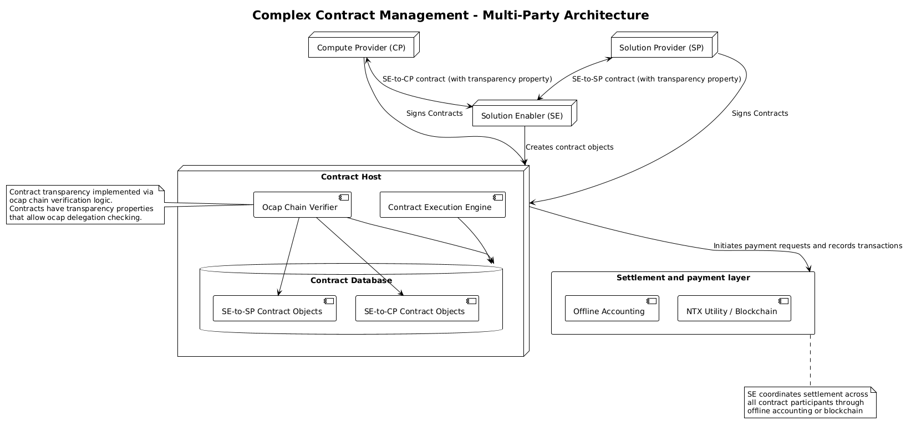
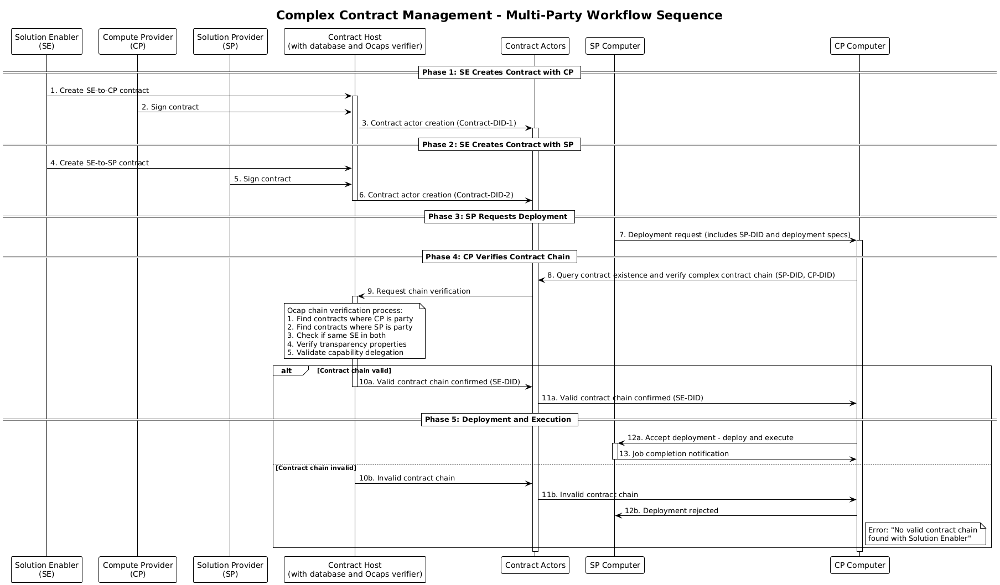
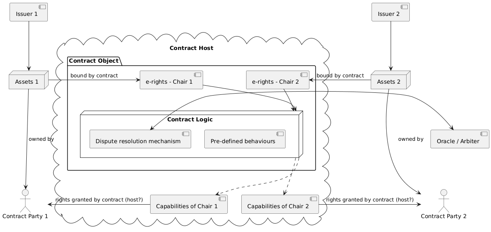

# NuNet Contracts and Tokenomics Architecture Specification

## Table of Contents

- [Executive Summary](#executive-summary)
- [Supported Behaviors](#supported-behaviors)
  - [Simple Contract Management](#simple-contract-management)
  - [Complex Contract Management with Solution Enabler](#complex-contract-management-with-solution-enabler)
- [Architecture Overview](#architecture-overview)
  - [System Components Hierarchy](#system-components-hierarchy)
  - [Core Architecture Diagram](#core-architecture-diagram)
- [Core Design Principles](#core-design-principles)
- [Conceptual Framework](#conceptual-framework)
  - [Contract Parties and Assets](#contract-parties-and-assets)
  - [Key Architectural Entities](#key-architectural-entities)
- [Implementation Architecture](#implementation-architecture)
- [References and Links](#references-and-links)


---

## Executive Summary

The NuNet contracts and tokenomics system represents a sophisticated integration of **Agoric's Electronic Rights Transfer Protocol (ERTP)** with NuNet's **object capability model** (nuActor system). This architecture enables secure, decentralized economic contracts for compute resource sharing while maintaining compatibility with both off-platform (Solutions-based) and on-platform (P2P) contract execution.

**Key Innovation**: The system unifies object capabilities (UCAN/nuActor) with economic contracts (Agoric ERTP), creating a secure, capability-based tokenomics layer that can operate with both trusted third parties and blockchain-based execution environments.

---
## Supported Behaviors

There are two basic behaviors supported by this iteration of the contracts package: *simple contract management* and *complex contract management*. 

### Simple Contract Management

The simple contract management workflow provides a streamlined approach for direct bilateral agreements between Service Providers and Compute Providers.

#### Key Components

- **Service Provider (SP)**: Organization that needs computational resources for their applications  
- **Compute Provider (CP)**: Organization that supplies computational resources
- **SP/CP Computers**: machines belonging to respective organizations
- **Contract Host (Solution Enabler)**: Neutral party that stores and validates contracts
- **Contract Actors with Execution Engine**: Runtime components that enforce contract terms
- **Contract Database**: Persistent storage for signed contract objects

#### Workflow Description

The simple contract management behavior follows this sequential process:

##### 1. Contract Establishment Phase

1. **Offline Agreement**: Service Provider and Compute Provider negotiate terms directly outside the system, establishing a bilateral agreement
2. **Contract Signing**: Both parties independently sign the contract using the contract package functionality
3. **Contract Storage**: The Contract Host stores the signed contract in the Contract Database
4. **Actor Initialization**: Contract Actors are initialized to enforce the agreed terms

##### 2. Deployment Request Phase

5. **Deployment Request**: A computer from the Service Provider organization requests deployment from the Compute Provider
6. **Contract Validation**: The Compute Provider queries Contract Actors to verify a valid signed contract exists
7. **Decision Point**:
   - **Valid Contract**: Compute Provider accepts and executes the deployment
   - **Invalid/Missing Contract**: Deployment request is rejected

#### Architecture Diagrams

<p align="center">
  
</p>

<p align="center">
  
</p>

### Complex Contract Management with Solution Enabler

> **⚠️ Note**: This behavior is not implemented in the current contract package and represents a future enhancement to the system.

The complex contract management workflow introduces a **Solution Enabler** as an intermediary that coordinates transparent multi-party contracts between **Solution Providers** and **Compute Providers**. This enables sophisticated deployment scenarios where contract verification happens through capability delegation chains.

#### Key Components

- **Solution Enabler (SE)**: Intermediary that creates and manages contracts with both Solution Providers and Compute Providers
- **Solution Provider (SP)**: Organization that provides computational solutions and requests deployments
- **Compute Provider (CP)**: Organization that supplies computational resources for execution
- **SP Computer**: Machine belonging to the Solution Provider organization that requests deployments
- **CP Computer**: Machine belonging to the Compute Provider organization that executes deployments
- **Contract Host**: Unified backend system with integrated database and Ocaps verifier for contract storage and verification
- **Contract Actors**: Interface layer that manages contract lifecycle and verification requests

#### Workflow Description

The complex contract management follows this multi-party process:

##### 1. Dual Contract Establishment Phase

1. **SE-to-CP Contract Creation**: Solution Enabler creates a contract with the Compute Provider
2. **CP Contract Signing**: Compute Provider signs the contract, triggering contract actor creation
3. **SE-to-SP Contract Creation**: Solution Enabler creates a separate contract with the Solution Provider  
4. **SP Contract Signing**: Solution Provider signs the contract, triggering contract actor creation

##### 2. Deployment Request Phase

5. **SP Deployment Request**: A computer from the Solution Provider organization requests deployment from the Compute Provider (includes SP-DID)

##### 3. Contract Chain Verification Phase

> **⚠️ Note**: This ocap chain verification functionality is not currently implemented and needs to be developed in order to support this complex contract management behavior.

6. **Contract Chain Query**: Compute Provider queries Contract Actors to verify the existence of a complex contract chain
7. **Chain Verification**: Contract Actors request verification from the Contract Host, which performs ocap chain verification to:
   - Find contracts where CP is a party
   - Find contracts where SP is a party  
   - Check if the same SE is involved in both contracts
   - Verify transparency properties
   - Validate capability delegation

##### 4. Deployment Decision Phase

8. **Verification Result**: Based on contract chain validity:
   - **Valid Chain**: Contract Host confirms valid chain → Contract Actors notify CP → Deployment accepted
   - **Invalid Chain**: Contract Host rejects chain → Contract Actors notify CP → Deployment rejected

##### 5. Deployment and Execution Phase

9. **Deployment Execution**: If valid, CP Computer accepts deployment and SP Computer executes the job
10. **Completion**: SP Computer notifies CP Computer of job completion

#### Architecture Diagrams

<p align="center">
  
</p>

<p align="center">
  
</p>

---

## Architecture Overview

### System Components Hierarchy

```
NuNet Platform
├── Device Management Service (DMS)
│   ├── Contract Sub-package
│   │   ├── Contract Objects (nuActors)
│   │   ├── Contract Logic (FSM)
│   │   └── Capability Management
│   ├── Orchestration Layer
│   └── nuActor System Integration
├── Contract Database (CloverDB/External)
└── Contract Host (Trusted Execution Environment)
```

### Core Architecture Diagram

Based on the detailed design from [GitLab Issue #371](https://gitlab.com/nunet/architecture/-/issues/371#note_2219820898):

<p align="center">
  
</p>


---

## Core Design Principles

### 1. **Electronic Rights Transfer Protocol (ERTP) Integration**
- **E-rights**: Digital representations of property rights to assets
- **Contract Objects**: Special nuActors that execute contract logic
- **Issuers**: Authorities that validate digital asset rights (we are not dealing with them explicitly in our contract logic)
- **Contract Hosts**: Trusted execution environments

### 2. **Object Capability Security Model**
- All economic interactions mediated through capability grants
- Contract parties can only access assets through contract-granted capabilities
- Capability delegation ensures secure resource access control

### 3. **Finite State Machine Contract Logic**
- All contracts modeled as deterministic state machines
- Well-defined side effects for input/output operations
- Support for both automated logic and dispute resolution mechanisms
- (currently only partially implemented as not needed for externally defined contracts to work -- which is the first iteration of contract package implementation)

### 4. **Blockchain-Agnostic Design**
- Current implementation uses trusted third parties (NuNet Solutions)
- Architecture supports adding blockchain based payment layers or even migration to blockchain-based execution;
- Object capability security maintained across execution environments

---

## Conceptual Framework

### Contract Parties and Assets

**Contract Parties**: Entities that enter into contracts with intention to exchange assets according to contract rules.

**Assets**: Physical property, computational resources, or services owned by contract parties. In NuNet context:
- **Compute Resources**: DMS-enabled machines, CPU/GPU time, storage
- **Financial Assets**: Payment tokens, coins, escrow funds
- **Service Rights**: Access to specific computational workflows

### Key Architectural Entities

#### **Issuer**
An authority that validates digital assets of its kind. Can be:
- Asset owner (simple cases)
- Third-party validation service  
- Blockchain-based validator
Our main usecase does not require explicit definition of issuers (owners of machines have right to delegate access to their compute resources without explicit proof, just by having physical access to a machine). Therefore issuers are not defined in current implementation of contract package.

#### **Contract Host** 
Trusted third party executing contract logic and maintaining records:
- **Current**: NuNet Solutions or trusted solution providers
- **Future**: Blockchain networks with smart contract support
- **Hybrid**: Combination of trusted entities and blockchain validation

#### **Contract Logic**
Two-part system:
1. **Pre-defined Behaviors**: Algorithmic logic (smart contracts)
2. **Dispute Resolution**: Oracle/arbiter mechanisms for non-predefined scenarios
Contracts are implemented as nuActors in the system, therefore can have their own execution environments running arbitrary logic. 

#### **Contract Chairs**
Expression of rights that contract grants to parties. Enables partial asset commitment to contracts.

#### **E-Rights**
Proof of property rights to assets bound by contract terms. Enable secure asset transfer based on contract logic execution.

---

## Implementation Architecture

### Contract Sub-Package Design

**Location**: `dms/contract` sub-package within Device Management Service

**Core Components**:

#### 1. **Contract Objects as nuActors**
- **DID-anchored**: Each contract has unique decentralized identifier
- **Persistent Execution**: Run as special allocation actors with own addresses and mailboxes
- **Message Dispatch**: Direct message handling via nuActor system
- **Security Isolation**: Restricted to trusted contract hosts only

#### 2. **Contract Database Integration**
- **Storage**: CloverDB (internal) or external document database
- **Format**: Go scripts following well-defined contract templates
- **Access**: Contract hosts pull contracts for execution
- **Versioning**: Support for contract updates and state transitions

#### 3. **Capability Management**
- **Issuing**: Contract host issues capabilities via nuActor dispatch
- **Verification**: Capability checking for contract execution
- **Delegation**: Contract-based capability grants to parties

---

## References and Links

### Primary Design Documents

1. **[Issue #371: Job orchestration design using Contract Database](https://gitlab.com/nunet/architecture/-/issues/371)**
   - Main conceptual design with comprehensive PlantUML diagrams
   - Electronic rights protocol architecture
   - Detailed contract object specifications

2. **[Issue #765: Contract sub-package conceptual design](https://gitlab.com/nunet/device-management-service/-/issues/765)**
   - Implementation guidelines for contract objects as nuActors  
   - Go-based contract patterns and finite state machine execution
   - Integration with DMS orchestration layer

3. **[Issue #699: Review Agoric concepts of Contracts with OCaps](https://gitlab.com/nunet/device-management-service/-/issues/699)**
   - Agoric ERTP integration research
   - Object capability model unification
   - Educational resources and implementation insights

### Architecture Work Packages

4. **[Issue #464: Network Tokenomics Layer](https://gitlab.com/nunet/architecture/-/issues/464)**
   - Comprehensive tokenomics implementation plan
   - P2P contracts based on conceptual design
   - Smart contracts for escrow, staking, and network incentives

5. **[Issue #469: Smart Contracts](https://gitlab.com/nunet/architecture/-/issues/469)**
   - Escrow contract implementation specifications
   - Staking contract mechanisms
   - Network incentives smart contracts integration

### Implementation Issues

6. **[Issue #486: Externally Defined Contracts](https://gitlab.com/nunet/architecture/-/issues/468)**
7. Related **[Merge Request #1931](https://gitlab.com/nunet/device-management-service/-/merge_requests/1031)**

### Related Resources

7. **Agoric Documentation**:
   - [Electronic Rights Transfer Protocol (ERTP)](https://docs.agoric.com/guides/ertp/)
   - [Agoric Programming Guide](https://docs.agoric.com/guides/js-programming/)

8. **Academic References**:
   - "The Digital Path: Smart Contracts and the Third World" by Mark S. Miller
   - "Markets and Computation: Agoric Open Systems"
   - "Distributed Electronic Rights in JavaScript"
   - "Habitat Chronicles: What Are Capabilities?"

---